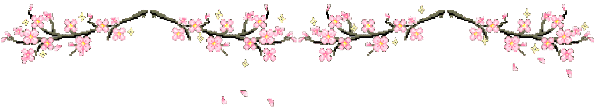
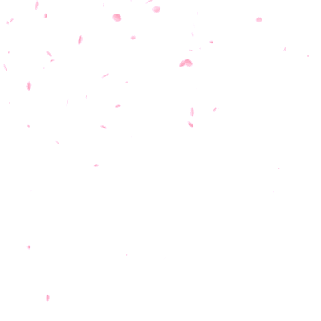
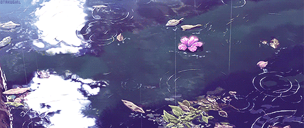
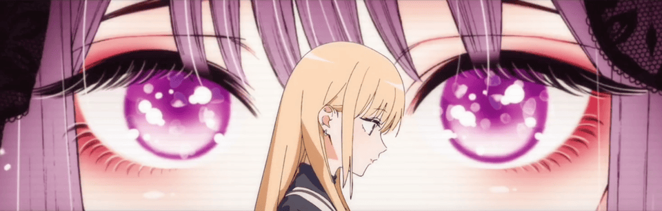

ようこそ / WELCOME TO MY CORNER OF GITHUB

<h1>ダンテ / Dante</h1>

<strong>Mizuhara in game. Dante at the keyboard.</strong> 
ゲームではMizuhara、キーボードの前ではDante。

I study information security and applied cryptography, and I enjoy building open-source software. I work on KanjiWidgets every day, and KryptBoard's browser preview and demo are live. 
情報セキュリティと応用暗号を学びながら、オープンソースのソフトウェアを作っています。KanjiWidgetsを毎日開発していて、KryptBoardのブラウザープレビューとデモも公開しています。

  
  
  
  
  

<table>
  <tr>
    <td width="69%" valign="top">
      <h2>自己紹介 / ABOUT</h2>
      
M.Tech student in Information Security at NSUT, focused on practical security and open-source software. Japanese learner (JLPT N4, conversational).

      
NSUTで情報セキュリティを専攻する修士課程の学生です。現在は漢字学習PWA「KanjiWidgets」を毎日開発し、送信前暗号化デモ「KryptBoard」も進めています。日本語はJLPT N4で、日常会話を少し話せます。

      <h3>いま / CURRENT FOCUS</h3>
      
<strong>KanjiWidgets</strong> is my daily project. It is an offline-first kanji PWA with spaced repetition for JLPT levels N5 through N1.

      

        
        
      

      
<strong>KryptBoard</strong> is a browser demo of authenticated encryption before text is sent. It uses ChaCha20-Poly1305.

      

        
        
        
      

      
<strong>FOCUS</strong> Applied cryptography and web security.

    </td>
    <td width="31%" align="center" valign="middle">
       
      
    </td>
  </tr>
</table>

<!--
<h2>技術と道具 / STUFF I USE</h2>

<strong>Languages</strong> C, C++, Go, Java, JavaScript, Python, HTML, CSS

<strong>Build</strong> Express.js, MySQL, Oracle, Unity

<strong>Tools</strong> Linux, Bash, PowerShell, Git, GitLab, Photoshop, Premiere Pro, After Effects

-->

<h2>記録と推し / STATS + ANIME</h2>
<table>
  <tr>
    <td width="50%" valign="top" align="center">
      <h3>GitHub / 記録</h3>
      <!-- Generated by .github/workflows/metrics.yml. -->
      
    </td>
    <td width="50%" valign="top" align="center">
      <h3>AniList / アニメ棚</h3>
      
<a href="https://anilist.co/user/spsc/">Open my AniList profile</a>

      <!-- Mayu counts loads of this anime-themed badge, not direct visits to AniList. -->
      
 <small>Badge loads, not direct AniList profile visits.</small>

      <!-- Generated from the compact AniList plugin in lowlighter/metrics. -->
      
    </td>
  </tr>
</table>

<h2>活動カレンダー / ACTIVITY CALENDAR</h2>
<table>
  <tr>
    <td width="16%" align="center" valign="middle">
      
    </td>
    <td width="43%" align="center" valign="middle">
      <!-- Generated by the isocalendar plugin in .github/workflows/metrics.yml. -->
      
    </td>
    <td width="41%" align="center" valign="middle">
      <h3>ISSUE &amp; PR FOLLOW-UP</h3>
      <!-- Generated by the follow-up plugin in .github/workflows/metrics.yml. -->
      
    </td>
  </tr>
</table>

<table>
  <tr>
    <td width="58%" valign="middle">
      <h2>放課後 / AFTER-SCHOOL CUT</h2>
      
Somewhere between the last commit and the next one.

    </td>
    <td width="42%" align="right" valign="middle">
      
    </td>
  </tr>
</table>

<h2>雨の時間 / RAINY-DAY CUT</h2>

Two small frames, same scale.

<table>
  <tr>
    <td width="50%" align="center">
      
    </td>
    <td width="50%" align="center">
      
    </td>
  </tr>
</table>

&nbsp;&nbsp;特別なコーギーを見つけました。 You found the special corgi.

<em>
プロフィールを見てくれてありがとう。 
よろしくお願いします。 
またね。
</em>

