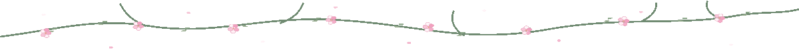

ようこそ / WELCOME TO MY CORNER OF GITHUB

<h1>ダンテ / Dante</h1>

<strong>Mizuhara in game. Dante at the keyboard.</strong>

Competitive programming, ethical hacking, game development. Make things, break things responsibly, queue Valorant.

<a href="https://github.com/brodante">GitHub</a> · <a href="https://linkedin.com/in/spsc">LinkedIn</a> · <a href="https://www.youtube.com/@brodanteyt">YouTube</a> · <a href="https://www.tryhackme.com/p/spsc">TryHackMe</a>

<table>
  <tr>
    <td width="69%" valign="top">
      <h2>自己紹介 / ABOUT</h2>
      
College student, builder, and ethical hacking enthusiast. I speak a little Japanese (JLPT N4, everyday-conversation level).

      
大学生です。C++のゲームエンジン「Chinatsu」を作りながら、脆弱性解析を勉強しています。日本語はJLPT N4で、日常会話を少し話せます。

      <h3>いま / CURRENT LOOP</h3>
      
<strong>BUILD</strong> Chinatsu, a C++ game engine. 
      <strong>LEARN</strong> Vulnerability exploitation and bug bounty hunting. 
      <strong>PLAY</strong> Valorant and CS:GO. 
      <strong>ODD SKILL</strong> I can eat chips without touching them.

    </td>
    <td width="31%" align="center" valign="middle">
       
      
    </td>
  </tr>
</table>

<h2>技術と道具 / STUFF I USE</h2>

<strong>Languages</strong> C, C++, Go, Java, JavaScript, Python, HTML, CSS

<strong>Build</strong> Express.js, MySQL, Oracle, Unity

<strong>Tools</strong> Linux, Bash, PowerShell, Git, GitLab, Photoshop, Premiere Pro, After Effects

<h2>記録 / GITHUB STATS</h2>
<!-- Generated by .github/workflows/metrics.yml. -->

<h2>アニメと漫画 / ANIME AND MANGA</h2>

My list lives at <a href="https://anilist.co/user/spsc/">AniList / アニリスト</a>.

<!-- Generated from the AniList plugin in lowlighter/metrics. -->

<table>
  <tr>
    <td width="58%" valign="middle">
      <h2>放課後 / AFTER-SCHOOL CUT</h2>
      
Somewhere between the last commit and the next one.

    </td>
    <td width="42%" align="right" valign="middle">
      
    </td>
  </tr>
</table>

<h2>雨の時間 / RAINY-DAY CUT</h2>

Two small frames, same scale.

<table>
  <tr>
    <td width="50%" align="center">
      
    </td>
    <td width="50%" align="center">
      
    </td>
  </tr>
</table>

特別なコーギーを見つけました。 You found the special corgi.

プロフィールを見てくれてありがとう。よろしくお願いします。またね。

Profile views: 

