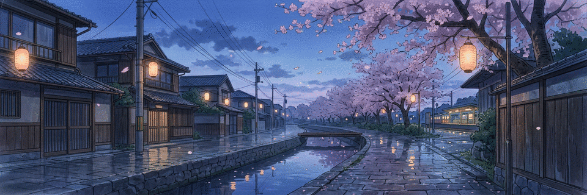

# Hi, I'm Dante

**Mizuhara in game. Dante when I build things.**

Competitive programming, ethical hacking, game development, and competitive gaming.

[GitHub](https://github.com/brodante) · [LinkedIn](https://linkedin.com/in/spsc) · [X](https://twitter.com/singh_senpai) · [Instagram](https://instagram.com/surya_pratap_singh_chauhan__) · [YouTube](https://www.youtube.com/@brodanteyt) · [TryHackMe](https://www.tryhackme.com/p/spsc)

<table>
  <tr>
    <td width="18%" align="center" valign="middle">
      
    </td>
    <td width="64%" valign="middle">
      <h2>About</h2>
      
College student, builder, and ethical hacking enthusiast. I speak a little Japanese (JLPT N4, everyday-conversation level).

      <h2>Currently</h2>
      <ul>
        <li>Building <strong>Chinatsu</strong>, a C++ game engine.</li>
        <li>Learning vulnerability exploitation.</li>
        <li>Happy to talk about C++, bug bounty hunting, Valorant, and CS:GO.</li>
        <li>A small talent: I can eat chips without touching them.</li>
      </ul>
    </td>
    <td width="18%" align="center" valign="middle">
      
    </td>
  </tr>
</table>

## Languages and tools

**Languages:** C, C++, Go, Java, JavaScript, Python, HTML, CSS 
**Development:** Express.js, MySQL, Oracle, Unity 
**Tools:** Linux, Bash, PowerShell, Git, GitLab, Photoshop, Premiere Pro, After Effects

## GitHub at a glance

<!-- This file is refreshed by .github/workflows/metrics.yml. -->

## Anime and manga

My AniList profile: [anilist.co/user/spsc](https://anilist.co/user/spsc/)

<!-- Generated from the AniList plugin in lowlighter/metrics. -->

## Rainy-day frames

<table>
  <tr>
    <td width="50%" align="center">
      
    </td>
    <td width="50%" align="center">
      
    </td>
  </tr>
</table>

## One last thing

You found the special corgi.

よろしくお願いします！

